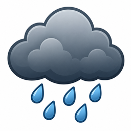

# ČHMÚ Radar pro Home Assistant

Jednoduchá custom integrace pro Home Assistant, která z radarových PNG dat ČHMÚ OpenData zjistí:

- jestli právě prší na zadaných souřadnicích,
- jestli se déšť blíží,
- odhad za kolik minut začne pršet.

Odhad pohybu srážek používá **OpenCV optical flow** nad dvěma po sobě jdoucími radarovými snímky.



> Testovací verze. Přepočet GPS → pixel používá přibližný bounding box radarového PNG. Pokud bude poloha posunutá, lze hranice mapy upravit v nastavení integrace.

## Entity

Integrace záměrně vytváří jen minimum entit:

| Entita | Typ | Popis |
|---|---|---|
| `binary_sensor.prsi` | binary sensor | Prší v nastaveném okruhu kolem souřadnic |
| `binary_sensor.dest_se_blizi` | binary sensor | Déšť se podle optical flow blíží |
| `sensor.odhad_deste` | sensor | Odhad za kolik minut začne pršet |
| `sensor.posledni_aktualizace` | sensor | Kdy integrace naposledy zpracovala radar |

Skutečné názvy entit v HA se mohou lišit podle názvu instance integrace.

Doplňkové hodnoty jsou v atributech entit:

- intenzita v místě,
- maximální intenzita v okolí,
- jistota výpočtu pohybu,
- čas radarového snímku,
- zdrojový soubor,
- pixelová pozice souřadnic v radarovém obrázku.

## Instalace přes HACS jako vlastní repozitář

1. Nahraj obsah tohoto ZIPu do nového GitHub repozitáře, například `ha-chmi-radar`.
2. V Home Assistantu otevři HACS.
3. Otevři `Custom repositories`.
4. Vlož URL GitHub repozitáře.
5. Kategorie: `Integration`.
6. Nainstaluj integraci.
7. Restartuj Home Assistant.
8. Přidej integraci přes `Nastavení → Zařízení a služby → Přidat integraci → ČHMÚ Radar`.

## Ruční instalace bez HACS

Zkopíruj složku:

```text
custom_components/chmi_radar
```

do Home Assistanta:

```text
/config/custom_components/chmi_radar
```

Potom restartuj Home Assistant a přidej integraci přes UI.

## Nastavení

Při přidání integrace se nastavuje:

- název,
- zeměpisná šířka,
- zeměpisná délka,
- okruh kolem domu v km,
- práh deště 1–255,
- maximální odhad v minutách,
- interval aktualizace,
- URL adresáře s PNG radarem,
- hranice mapy pro přepočet GPS → pixel.

Výchozí zdroj:

```text
https://opendata.chmi.cz/meteorology/weather/radar/composite/maxz/png/
```

## Příklad notifikace

```yaml
alias: Upozornění na blížící se déšť
trigger:
  - platform: state
    entity_id: binary_sensor.dest_se_blizi
    to: "on"
action:
  - service: notify.mobile_app_telefon
    data:
      title: Déšť
      message: >
        Podle radaru začne pršet přibližně za
        {{ states('sensor.odhad_deste') }} minut.
mode: single
```

## Jak funguje odhad

Integrace stáhne aktuální radarový PNG snímek a porovná ho s předchozím snímkem. OpenCV Farnebäck optical flow odhadne pohyb srážkových pixelů. Integrace poté promítne aktuální srážky dopředu v čase a ověří, jestli jejich trajektorie zasáhne nastavený okruh kolem domu.

Po restartu Home Assistanta bude odhad dostupný až po druhém načteném radarovém snímku.

## Ikona

Repozitář obsahuje vlastní ikonu deštivého mraku:

```text
icon.png
icons/chmi_radar.svg
custom_components/chmi_radar/icon.png
custom_components/chmi_radar/icons/chmi_radar.svg
```

## Známá omezení

- GPS → pixel je zatím přibližný.
- PNG analýza vychází z barevné vrstvy, ne z čistých HDF5 dat.
- Optical flow je odhad pohybu, ne oficiální meteorologická předpověď.
- Po restartu je odhad dostupný až po druhém radarovém snímku.

## Licence

MIT
